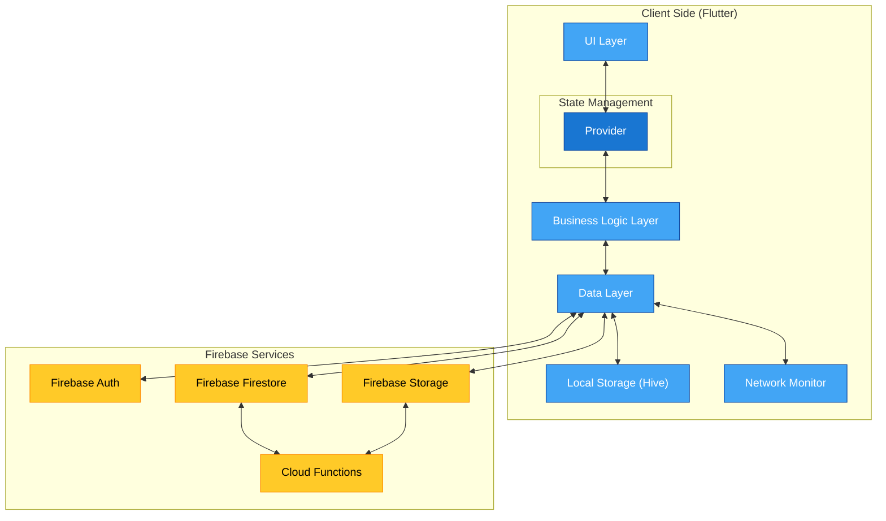
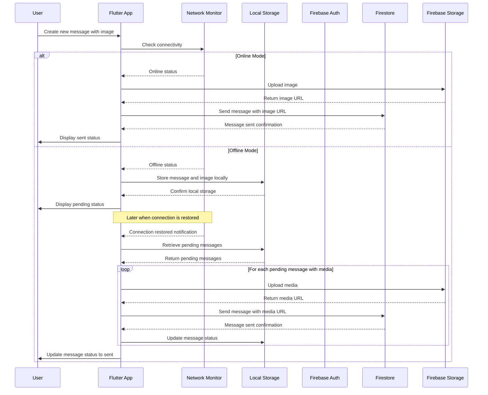
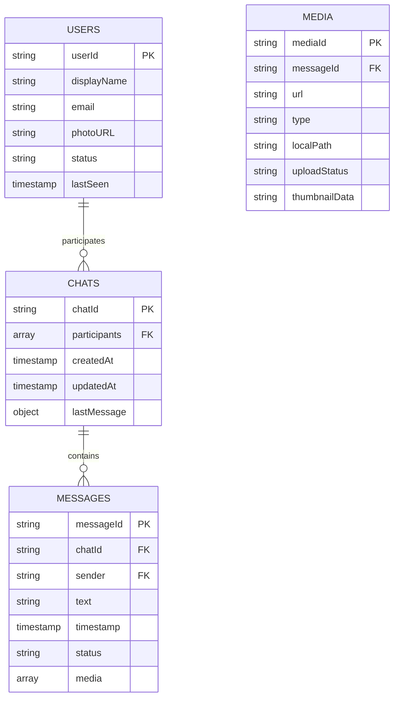
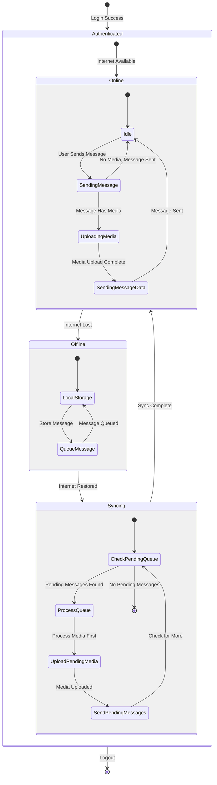
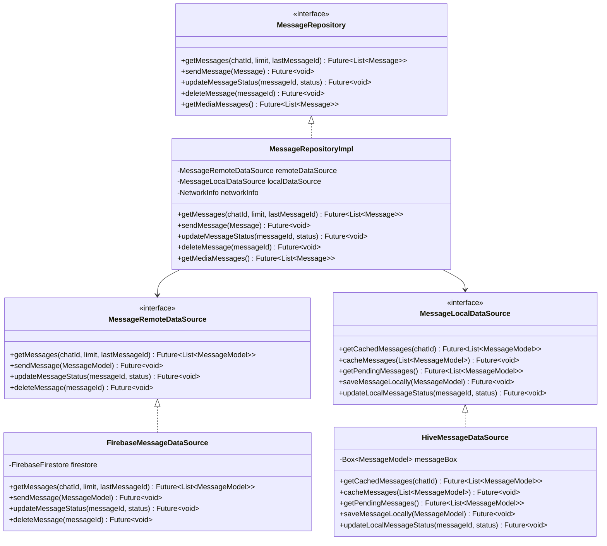
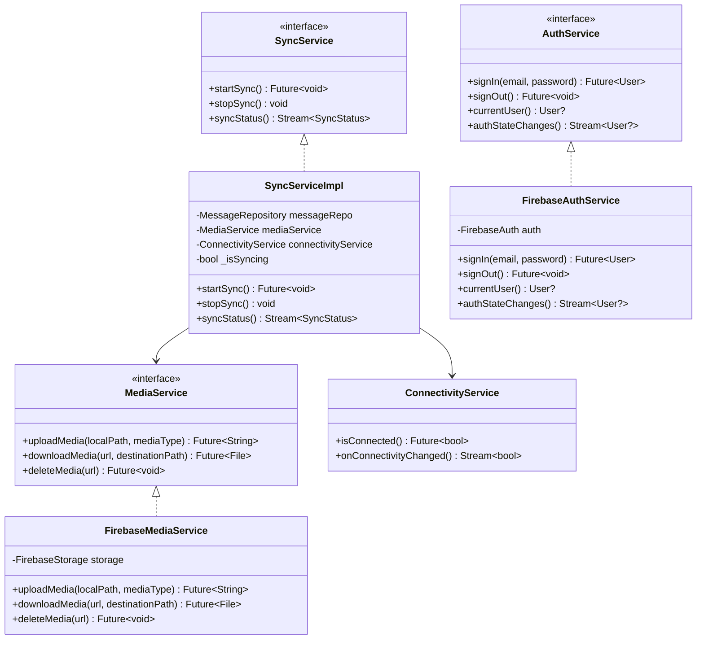
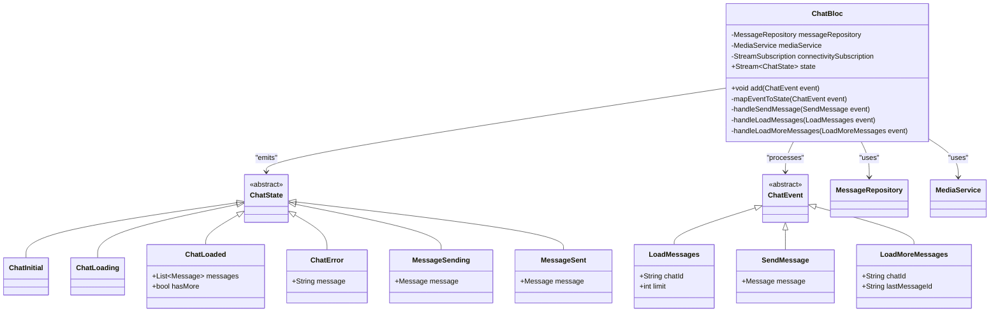
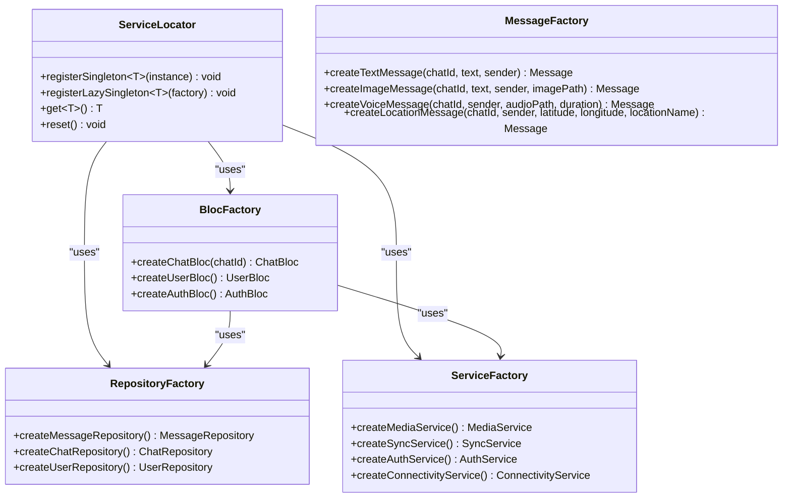

# WhatsApp-Style Chat Application with Firebase

## Project Overview

A feature-rich chat application inspired by WhatsApp, supporting both offline and online modes with seamless synchronization. The app stores messages and media locally while offline and automatically syncs data when internet connectivity is restored.

## Table of Contents

1. [Key Features](#key-features)
2. [Architecture Overview](#architecture-overview)
   - [Architecture Diagrams](#architecture-diagrams)
   - [Design Patterns](#design-patterns)
   - [Technical Architecture](#technical-architecture)
   - [Data Flow](#data-flow)
3. [Database Design](#database-design)
   - [Firebase Schema](#firebase-schema)
   - [Local Storage Schema](#local-storage-schema)
4. [Implementation Plan](#implementation-plan)
5. [Development Guidelines](#development-guidelines)
   - [Libraries & Dependencies](#libraries--dependencies)
   - [Performance Considerations](#performance-considerations)
6. [Future Enhancements](#future-enhancements)

## Key Features

- **Offline/Online Functionality**: Messages and media are stored locally while offline and synchronized when back online
- **Media Sharing**: Support for image, video, audio, document, and location sharing with background uploads
- **Smooth Message Loading**: Implements a streaming mechanism to load messages in batches (initially 100 messages with more loaded as users scroll up)
- **Firebase Backend**: Leverages Firebase's Firestore, Storage, and Authentication services
- **Cross-Platform**: Built with Flutter for iOS and Android compatibility
- **Multi-Device Support**: Users can access their account from multiple devices with proper synchronization

## Architecture Overview

### Architecture Diagrams

#### Component Diagram



#### Sequence Diagram - Message Sending (Online/Offline)



#### Database Diagram



#### State Diagram



#### Folder structure

```text
project_root/
├── lib/
│   ├── core/                      # Core application code
│   │   ├── constants/             # App constants, theme data, string resources
│   │   ├── errors/                # Custom error handling
│   │   ├── navigation/            # Navigation service, route generation
│   │   ├── network/               # Network monitoring, connectivity service
│   │   ├── utils/                 # Utility functions and helpers
│   │   └── widgets/               # Shared widgets used across features
│   │
│   ├── data/                      # Data layer
│   │   ├── datasources/
│   │   │   ├── local/             # Local data sources (Hive implementations)
│   │   │   └── remote/            # Remote data sources (Firebase implementations)
│   │   ├── models/                # Data models
│   │   │   ├── chat.dart
│   │   │   ├── message.dart
│   │   │   ├── user.dart
│   │   │   └── media.dart
│   │   └── repositories/          # Repository implementations
│   │
│   ├── domain/                    # Domain layer
│   │   ├── entities/              # Domain entities
│   │   ├── repositories/          # Repository interfaces
│   │   └── usecases/              # Business logic use cases
│   │
│   ├── features/                  # Feature modules
│   │   ├── auth/                  # Authentication feature
│   │   │   ├── presentation/      # UI components
│   │   │   ├── domain/            # Feature-specific domain logic
│   │   │   └── data/              # Feature-specific data handling
│   │   │
│   │   ├── chat/                  # Chat feature
│   │   │   ├── presentation/
│   │   │   │   ├── screens/       # Chat screens
│   │   │   │   ├── widgets/       # Chat-specific widgets
│   │   │   │   └── bloc/          # State management
│   │   │   ├── domain/            # Chat domain logic
│   │   │   └── data/              # Chat data handling
│   │   │
│   │   ├── media/                 # Media handling feature
│   │   │   ├── presentation/
│   │   │   ├── domain/
│   │   │   └── data/
│   │   │
│   │   └── settings/              # User settings feature
│   │
│   ├── services/                  # Service layer
│   │   ├── auth_service.dart      # Authentication service
│   │   ├── media_service.dart     # Media handling service
│   │   ├── sync_service.dart      # Synchronization service
│   │   └── storage_service.dart   # Local storage service
│   │
│   ├── di/                        # Dependency injection
│   │   └── service_locator.dart   # Service locator implementation
│   │
│   ├── app.dart                   # App widget and initialization
│   └── main.dart                  # Entry point
│
├── assets/                        # Static assets
│   ├── images/                    # Image assets
│   ├── fonts/                     # Custom fonts
│   └── animations/                # Lottie animations
│
├── test/                          # Test files mirroring lib structure
├── android/                       # Android-specific code
├── ios/                           # iOS-specific code
├── pubspec.yaml                   # Dependencies
└── README.md                      # Project documentation
```

### Design Patterns

The application uses several design patterns to ensure scalability, testability, and maintainability.

#### Repository Pattern

The Repository Pattern abstracts data sources and provides a clean API for data access operations.



**Benefits**:

- Separates data layer from business logic
- Provides a clean, consistent API for data operations
- Makes code more testable by enabling mocking of data sources
- Facilitates implementation of offline-first strategies
- Enables seamless switching between data sources (remote/local)

#### Service Layer Pattern

The Service Layer pattern encapsulates business logic related to background operations, file handling, and other services.



**Benefits**:

- Isolates complex business logic into dedicated services
- Enables background processing and handling of long-running tasks
- Provides clean separation of concerns
- Makes components more reusable across different parts of the app
- Simplifies testing of business logic in isolation

#### State Management Pattern (BLoC)

The BLoC (Business Logic Component) pattern separates UI from business logic, using streams for reactivity.



**Benefits**:

- Clear separation between UI and business logic
- Reactive approach with stream-based state management
- Improved testability of business logic
- Predictable state transitions
- Efficient rebuilds of only the affected UI components
- Easy to debug and trace state changes

#### Factory Pattern

Factory Patterns create complex objects and services with proper dependency injection.



**Benefits**:

- Centralizes object creation logic
- Provides a consistent way to create complex objects
- Simplifies dependency injection
- Makes code more testable by allowing easy substitution of implementations
- Encapsulates initialization details

### Technical Architecture

#### Frontend

- Flutter for cross-platform mobile development
- BLoC pattern for state management
- Go Router for app navigation

#### Backend

- Firebase Authentication for user management
- Firebase Firestore for message storage
- Firebase Storage for media files
- Firebase Cloud Functions for background processing

### Data Flow

1. **Message Sending Process**:
   - Check network connectivity
   - If online: Upload media files → Send message with file references
   - If offline: Store message and media locally → Queue for sync

2. **Synchronization Process**:
   - Monitor network connectivity changes
   - On reconnection, retrieve pending messages from local storage
   - Upload pending media files first
   - Send queued messages with updated media references
   - Update message status across all user devices

3. **Message Loading Mechanism**:
   - Initial fetch of 100 most recent messages
   - Load additional messages (50-100) as user scrolls up
   - Implement efficient caching to minimize database reads

4. **Multi-Device Synchronization**:
   - Each device identifies itself with a unique deviceId for tracking
   - Only the originating device processes its own pending messages from local storage
   - Message status updates are synchronized across all devices
   - Device-specific message queues in local storage prevent duplicate uploads

## Database Design

### Firebase Schema

#### Users Collection

```text
users/{userId}
  - displayName: string
  - email: string
  - photoURL: string
  - status: string
  - lastSeen: timestamp
```

**Example User Document**:

```json
// users/user123
{
  "displayName": "John Smith",
  "email": "john.smith@example.com",
  "photoURL": "https://firebasestorage.googleapis.com/users/avatars/user123.jpg",
  "status": "Available",
  "lastSeen": "2023-10-20T15:45:32Z"
}
```

#### Chats Collection

```text
Chats/{chatId}
  - participants: [userId]
  - createdAt: timestamp
  - updatedAt: timestamp
  - lastMessage: {
      text: string,
      sender: userId,
      timestamp: timestamp,
      hasMedia: boolean,
      mediaType: string (optional)
    }
```

**Example Chat Document**:

```json
// Chats/chat101 - Group chat with image in last message
{
  "participants": ["user123", "user789", "user456"],
  "createdAt": "2023-10-10T14:30:00Z",
  "updatedAt": "2023-10-20T15:12:45Z",
  "lastMessage": {
    "text": "Photos from yesterday's event",
    "sender": "user789",
    "timestamp": "2023-10-20T15:12:45Z",
    "hasMedia": true,
    "mediaType": "image"
  }
}
```

#### Messages Collection

```text
Chats/{chatId}/Messages/{messageId}
  - sender: userId
  - text: string
  - timestamp: timestamp
  - status: "sent" | "delivered" | "read" | "pending"
  - media: [
      {
        url: string,
        type: "image" | "video" | "audio" | "file" | "location",
        localPath: string (for offline storage),
        uploadStatus: "pending" | "uploading" | "uploaded" | "failed",
        thumbnailData: string (base64 encoded small thumbnail for offline use),
        additionalData: object (optional - for type-specific data)
      }
    ]
```

**Example Message Document**:

```json
// Chats/chat101/Messages/msg234 - Message with multiple images
{
  "sender": "user789",
  "text": "Photos from yesterday's event",
  "timestamp": "2023-10-20T15:12:45Z",
  "status": "sent",
  "media": [
    {
      "url": "https://firebasestorage.googleapis.com/messages/images/event1.jpg",
      "type": "image",
      "localPath": "/data/user/0/com.example.chatapp/files/media/event1.jpg",
      "thumbnailData": "data:image/jpeg;base64,/9j/4AAQSkZJRgABAQEAYABgAAD/2wBDAAEBAQ...",
      "uploadStatus": "uploaded",
      "additionalData": {
        "width": 1600,
        "height": 1200
      }
    },
    {
      "url": "https://firebasestorage.googleapis.com/messages/images/event2.jpg",
      "type": "image",
      "localPath": "/data/user/0/com.example.chatapp/files/media/event2.jpg",
      "thumbnailData": "data:image/jpeg;base64,/9j/4AAQSkZJRgABAQEAYABgAAD/2wBDAAEBAQ...",
      "uploadStatus": "uploaded",
      "additionalData": {
        "width": 1600,
        "height": 1200
      }
    }
  ]
}
```

### Local Storage Schema

#### Chat Storage Structure

Each chat has its own dedicated local storage for messages, media, and status information.

```text
chats/{chatId}/
  - metadata (last accessed, unread count, draft message)
  - messages/ (online messages cached locally)
  - pendingMessages/ (offline messages waiting to be sent)
  - media/ (locally stored media files)
```

#### Pending Messages (By Chat)

```text
chats/{chatId}/pendingMessages/{messageId}
  - text: string
  - sender: userId
  - timestamp: timestamp
  - media: [
      {
        localPath: string,
        type: string,
        thumbnailData: string (base64 encoded small thumbnail),
        additionalData: object (optional)
      }
    ]
```

**Example Pending Message**:

```json
// chats/chat789/pendingMessages/msg123
{
  "text": "This message was created offline",
  "sender": "user123",
  "timestamp": "2023-10-20T18:45:10Z",
  "media": [
    {
      "localPath": "/data/user/0/com.example.chatapp/files/media/chat789/offline_image.jpg",
      "type": "image",
      "thumbnailData": "data:image/jpeg;base64,/9j/4AAQSkZJRgABAQEAYABgAAD/2wBDAAEBAQ...",
      "additionalData": {
        "width": 1200,
        "height": 900,
        "caption": "Taken during network outage"
      }
    }
  ]
}
```

#### Local Cache for Messages

Messages received from Firebase are cached locally for offline access and faster loading:

```text
chats/{chatId}/messages/{messageId}
  - same structure as Firebase Messages with additional metadata for local use
  - isRead: boolean (local read status)
  - localTimestamp: timestamp (when the message was received locally)
```

#### Local Media Storage

Media files are stored in a structured format for efficient access:

```text
media/{chatId}/{mediaType}/{filename}
```

## Implementation Plan

### Phase 1: Setup & Authentication

- Project initialization with Flutter and Firebase
- Implement user authentication flow
- Create basic UI components

### Phase 2: Core Chat Functionality

- Implement basic messaging (online only)
- Design and implement database schema
- Create chat UI with message bubbles

### Phase 3: Offline Support

- Implement local storage for messages using Hive
- Create chat-specific storage structure
- Set up synchronization mechanism
- Create network status monitoring
- Implement device-specific message tracking
- Create device-specific pending message queues in local storage

### Phase 4: Media Sharing

- Implement media picker
- Set up Firebase Storage integration
- Develop background upload queue system
- Implement thumbnail generation for images, videos and other media types
- Create waveform visualization for audio messages
- Create efficient caching system for thumbnails

### Phase 5: Message Streaming

- Implement pagination/infinite scrolling
- Optimize message loading performance
- Add read receipts and typing indicators

### Phase 6: Testing & Polishing

- Cross-platform testing
- Performance optimization
- UI/UX refinements

## Development Guidelines

### Libraries & Dependencies

- **Flutter & Dart**: Core framework
- **Firebase**: firebase_core, firebase_auth, cloud_firestore, firebase_storage
- **State Management**: provider
- **Networking**: connectivity_plus, flutter_offline
- **Local Storage**: hive for local database and offline storage
- **Media Handling**: image_picker, cached_network_image and other media handling libraries

### Performance Considerations

- Implement efficient caching strategies
- Use Firebase indexing effectively
- Optimize image sizes before upload
- Generate and store small thumbnails as base64 strings for immediate loading
- Implement lazy loading for media content
- Use Firebase offline persistence
- Organize local storage by chat for faster access to recent conversations

## Future Enhancements

- End-to-end encryption
- Voice/video calling
- Multi-device synchronization improvements
- Enhanced group chat features
- Message reactions and replies
