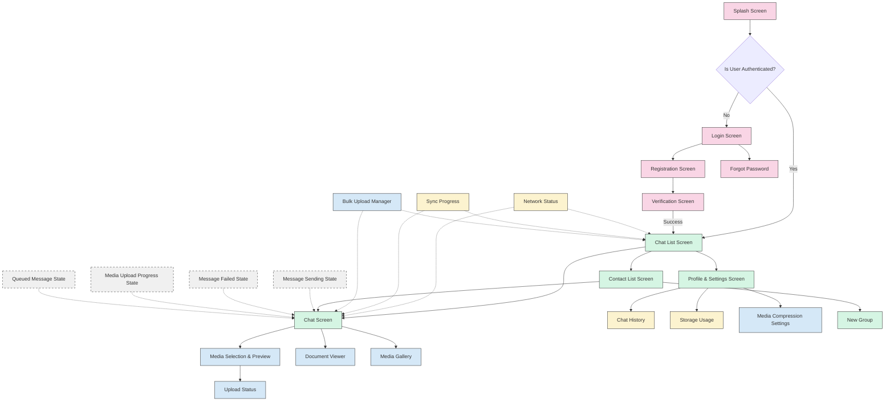

# Route Architecture

The application implements a clean, layered routing architecture that aligns with the overall clean architecture of the application. The routing system is designed to support offline-first capabilities, state preservation, and deep linking.

## Navigation Routes Diagram

The following diagram illustrates the navigation routes between different screens in the application:



## Go Router Implementation

The application uses Go Router for advanced navigation features including:

```dart
// core/navigation/router.dart
final router = GoRouter(
  initialLocation: '/',
  observers: [FirebaseAnalyticsObserver(analytics: analytics)],
  routes: [
    // Auth routes
    GoRoute(
      path: '/',
      name: 'splash',
      builder: (context, state) => const SplashScreen(),
    ),
    GoRoute(
      path: '/login',
      name: 'login',
      builder: (context, state) => const LoginScreen(),
    ),
    
    // Main application shell with nested navigation
    ShellRoute(
      builder: (context, state, child) => AppShell(child: child),
      routes: [
        // Chat routes nested in app shell
        GoRoute(
          path: '/chats',
          name: 'chat_list',
          builder: (context, state) => const ChatListScreen(),
          routes: [
            GoRoute(
              path: ':chatId',
              name: 'chat',
              builder: (context, state) {
                final chatId = state.params['chatId']!;
                final isGroup = state.queryParams['isGroup'] == 'true';
                return IndividualChatScreen(
                  chatId: chatId,
                  isGroup: isGroup,
                );
              },
              routes: [
                GoRoute(
                  path: 'media',
                  name: 'media_gallery',
                  builder: (context, state) {
                    final chatId = state.params['chatId']!;
                    return MediaGalleryScreen(chatId: chatId);
                  },
                ),
              ],
            ),
          ],
        ),
        
        // Contacts route
        GoRoute(
          path: '/contacts',
          name: 'contacts',
          builder: (context, state) => const ContactListScreen(),
        ),
        
        // Settings route and subroutes
        GoRoute(
          path: '/settings',
          name: 'settings',
          builder: (context, state) => const ProfileSettingsScreen(),
          routes: [
            GoRoute(
              path: 'media-compression',
              name: 'media_compression',
              builder: (context, state) => const MediaCompressionSettingsScreen(),
            ),
          ],
        ),
      ],
    ),
  ],
  // Custom error screen for invalid routes
  errorBuilder: (context, state) => RouteErrorScreen(error: state.error),
  
  // Custom redirect logic for authentication and offline handling
  redirect: (context, state) {
    final authService = serviceLocator<AuthService>();
    final connectivityService = serviceLocator<ConnectivityService>();
    final isAuthenticated = authService.isAuthenticated;
    final isOnboarded = authService.isOnboarded;
    
    // Check if user is authenticated
    if (!isAuthenticated && !state.location.startsWith('/login')) {
      return '/login';
    }
    
    // Redirect to onboarding if needed
    if (isAuthenticated && !isOnboarded && !state.location.startsWith('/onboarding')) {
      return '/onboarding';
    }
    
    // Allow normal navigation
    return null;
  },
);
```

## Offline Routing Strategy

The application implements a special offline routing strategy to handle navigation when the device is offline:

1. **Route State Persistence**: Routes and navigation state are stored in local storage (Hive) to maintain continuity during offline sessions.

2. **Conditional UI Rendering**: Each screen checks connectivity status and adapts its UI and behavior accordingly:

   ```dart
   class IndividualChatScreen extends StatelessWidget {
     @override
     Widget build(BuildContext context) {
       return Consumer<ConnectivityProvider>(
         builder: (context, connectivity, child) {
           final isOffline = !connectivity.isConnected;
           
           return Scaffold(
             appBar: AppBar(
               title: Text('Chat'),
               actions: [
                 if (isOffline) OfflineIndicator(),
               ],
             ),
             body: Column(
               children: [
                 if (isOffline) OfflineBanner(),
                 Expanded(
                   child: MessageList(offlineMode: isOffline),
                 ),
                 MessageComposer(offlineMode: isOffline),
               ],
             ),
           );
         },
       );
     }
   }
   ```

3. **Deep Linking Support**: The application handles deep links properly even in offline mode by:
   - Storing the deep link intent
   - Processing it when connectivity is restored
   - Providing appropriate feedback to the user about the offline status

## Route Parameters and Data Passing

The application uses strongly typed route parameters for type safety:

```dart
// Domain-based route parameter models
class ChatRouteParams {
  final String chatId;
  final String recipientName;
  final bool isGroup;
  final bool offlineMode;
  
  const ChatRouteParams({
    required this.chatId,
    required this.recipientName,
    this.isGroup = false,
    this.offlineMode = false,
  });
  
  // Convert to route parameters for Go Router
  Map<String, String> toRouteParams() => {
    'chatId': chatId,
    'isGroup': isGroup.toString(),
  };
  
  // Convert to query parameters for Go Router
  Map<String, String> toQueryParams() => {
    'recipient': recipientName,
    'offline': offlineMode.toString(),
  };
  
  // Create from Go Router state
  factory ChatRouteParams.fromState(GoRouterState state) {
    return ChatRouteParams(
      chatId: state.params['chatId'] ?? '',
      recipientName: state.queryParams['recipient'] ?? 'Unknown',
      isGroup: state.queryParams['isGroup'] == 'true',
      offlineMode: state.queryParams['offline'] == 'true',
    );
  }
}
```

## Navigation Integration with Repository Pattern

The navigation system integrates with the repository pattern to handle data-dependent navigation:

```dart
class ChatNavigationUseCase {
  final ChatRepository chatRepository;
  final NavigationService navigationService;
  
  const ChatNavigationUseCase({
    required this.chatRepository,
    required this.navigationService,
  });
  
  // Navigate to a chat with proper data loading
  Future<void> navigateToChat(String chatId) async {
    try {
      // Pre-fetch chat data if online
      final chat = await chatRepository.getChatById(chatId);
      
      // Navigate with proper parameters
      await navigationService.navigateTo(
        'chat',
        params: ChatRouteParams(
          chatId: chatId,
          recipientName: chat?.recipientName ?? 'Unknown',
          isGroup: chat?.isGroup ?? false,
          offlineMode: !await connectivityService.isConnected(),
        ).toRouteParams(),
      );
    } catch (e) {
      // If error occurs (likely offline), navigate with minimal params
      await navigationService.navigateOfflineMode(
        'chat',
        params: {'chatId': chatId},
      );
    }
  }
}
```

## State Preservation During Navigation

The application preserves important state during navigation using a combination of:

1. **Provider State Management**: Global application state is managed using Provider, accessible across routes

2. **Local Storage Persistence**: Critical navigation state is persisted in Hive for offline and session persistence

3. **Route-Specific State Containers**: Each major feature has dedicated state containers that survive navigation events

4. **Deep Link Handling**: The application supports proper state restoration when opened via deep links:

```dart
// Handle incoming deep links for sharing media to chats
void handleShareIntent(Uri deepLink) {
  final chatId = deepLink.queryParameters['chatId'];
  final mediaUri = deepLink.queryParameters['mediaUri'];
  
  if (chatId != null && mediaUri != null) {
    // Check connectivity before navigation
    if (connectivityService.isConnected) {
      navigationService.navigateTo(
        'chat',
        params: {
          'chatId': chatId,
          'sharedMedia': mediaUri,
        },
      );
    } else {
      // Store intent for later processing
      deeplinkRepository.storeShareIntent(chatId, mediaUri);
      navigationService.navigateOfflineMode('chat', params: {'chatId': chatId});
      // Show toast that sharing will happen when online
    }
  }
}
```

## Navigation Strategy

The application uses a combination of navigation approaches:

1. **Tab-based Navigation**: The main app interface uses bottom tabs for switching between:
   - Chats
   - Calls (future enhancement)
   - Contacts
   - Settings

2. **Stack-based Navigation**: For drilling down into content like:
   - Chat list → Individual chat → Media preview
   - Settings → Media compression settings

3. **Modal Overlays**: For temporary dialogs and quick actions:
   - Upload progress
   - Network status changes
   - Message sending states

4. **Custom Transitions**: The app implements platform-adaptive transitions:
   - Material Design page transitions on Android
   - Cupertino transitions on iOS

The navigation system is designed to handle the offline-first approach by:

- Preserving state during connectivity changes
- Providing clear UI indicators for offline mode
- Queuing navigation actions that require online connectivity
- Supporting seamless recovery when coming back online

## TypedGoRoute Implementation

The application uses a more type-safe approach with `TypedGoRoute` annotations for better compile-time safety and code organization:

```dart
// core/navigation/routes.dart

@TypedGoRoute<SplashRoute>(path: '/splash')
class SplashRoute extends GoRouteData2 {
  final BagDataRoute? $extra;
  SplashRoute({this.$extra});
  @override
  Widget binding(BuildContext context) {
    return const SplashScreen();
  }
}

@TypedGoRoute<LoginRoute>(path: '/login')
class LoginRoute extends GoRouteData2 {
  final BagDataRoute? $extra;

  LoginRoute({this.$extra});

  @override
  Widget binding(BuildContext context) => LoginScreen();
}

@TypedGoRoute<SignUpRoute>(path: '/signup')
class SignUpRoute extends GoRouteData2 {
  final BagDataRoute? $extra;

  SignUpRoute({this.$extra});

  @override
  Widget binding(BuildContext context) {
    return SignUpScreen();
  }
}

@TypedGoRoute<HomeScreenRoute>(path: '/', routes: [
  // Chat routes
  TypedGoRoute<ChatListRoute>(path: 'chats', routes: [
    TypedGoRoute<ChatRoute>(path: ':chatId', routes: [
      TypedGoRoute<MediaGalleryRoute>(path: 'media'),
    ]),
  ]),
  
  // Contacts route
  TypedGoRoute<ContactListRoute>(path: 'contacts'),
  
  // Settings routes
  TypedGoRoute<ProfileSettingsRoute>(path: 'settings', routes: [
    TypedGoRoute<MediaCompressionSettingsRoute>(path: 'media-compression'),
    TypedGoRoute<StorageUsageRoute>(path: 'storage'),
    TypedGoRoute<ChatHistoryRoute>(path: 'history'),
  ]),
])
class HomeScreenRoute extends GoRouteData2 {
  final BagDataRoute? $extra;
  final String? view;
  final String? tab;

  static HomeScreenController? instance;

  HomeScreenRoute({this.$extra, this.view, this.tab});

  @override
  FutureOr<String?> redirectWithBag(BuildContext context, BagDataRoute extra) => _signRedirect(context, extra);

  @override
  Widget binding(BuildContext context) {
    return KeepAliveWidget(
      child: HomeScreen(controller: instance ??= HomeScreenController(homeView: HomeView.getOfName(view), tab: tab)),
    );
  }
}

// Example of a route with parameters
class ChatRoute extends GoRouteData2 {
  final String chatId;
  final BagDataRoute? $extra;
  final bool isGroup;

  ChatRoute({
    required this.chatId,
    this.$extra,
    this.isGroup = false,
  });

  @override
  Widget binding(BuildContext context) {
    return IndividualChatScreen(
      chatId: chatId,
      isGroup: isGroup,
    );
  }
}

// Route that supports offline mode
class MediaGalleryRoute extends GoRouteData2 {
  final String chatId;
  final BagDataRoute? $extra;
  final bool offlineMode;

  MediaGalleryRoute({
    required this.chatId,
    this.$extra,
    this.offlineMode = false,
  });

  @override
  FutureOr<String?> redirectWithBag(BuildContext context, BagDataRoute extra) {
    final connectivityService = serviceLocator<ConnectivityService>();
    if (!connectivityService.isConnected && !offlineMode) {
      // Show offline indicator and potentially return alternate route
      return null; // Or return fallback route
    }
    return null;
  }

  @override
  Widget binding(BuildContext context) {
    return MediaGalleryScreen(
      chatId: chatId,
      offlineMode: offlineMode,
    );
  }
}
```

## Benefits of TypedGoRoute Approach

The TypedGoRoute approach offers several advantages over the traditional GoRouter implementation:

1. **Type Safety**: Routes are strongly typed with parameters that can be validated at compile-time.

2. **Cleaner Navigation**: Navigation uses generated extension methods that provide IDE autocompletion.

3. **Parameter Validation**: Required route parameters are enforced through the constructor.

4. **Redirect Logic Encapsulation**: Each route can encapsulate its own redirect logic through the `redirectWithBag` method.

5. **Extra Data Support**: The `$extra` parameter allows passing additional non-URL data during navigation.

## Navigation Implementation with TypedGoRoute

Using the typed approach simplifies navigation throughout the application:

```dart
// Navigate to a chat
context.go(ChatRoute(
  chatId: 'chat-123',
  isGroup: true,
).location);

// Or using the extension methods generated by go_router_builder
ChatRoute(
  chatId: 'chat-123',
  isGroup: true,
).go(context);

// Navigating with extra data
LoginRoute(
  $extra: BagDataRoute(
    data: {'lastVisited': DateTime.now()},
  ),
).go(context);
```

## Unified State Management

The TypedGoRoute pattern integrates well with the application's state management approach:

1. **BagDataRoute**: A custom container for passing complex state objects during navigation.

2. **Controller Pattern**: Routes can instantiate and maintain controllers, such as the HomeScreenController.

3. **Keep-Alive State**: The KeepAliveWidget helps preserve widget state during tab navigation.

## Offline Handling with TypedGoRoute

The TypedGoRoute pattern enhances offline handling through:

1. **Route-level Offline Checks**: Each route can implement offline detection in its redirectWithBag method.

2. **Offline Mode Parameters**: Routes like MediaGalleryRoute accept an offlineMode parameter to adjust behavior.

3. **State Preservation**: The KeepAliveWidget helps maintain state during connectivity changes.
