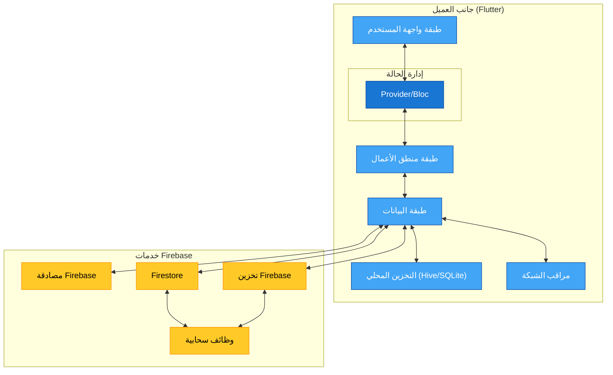
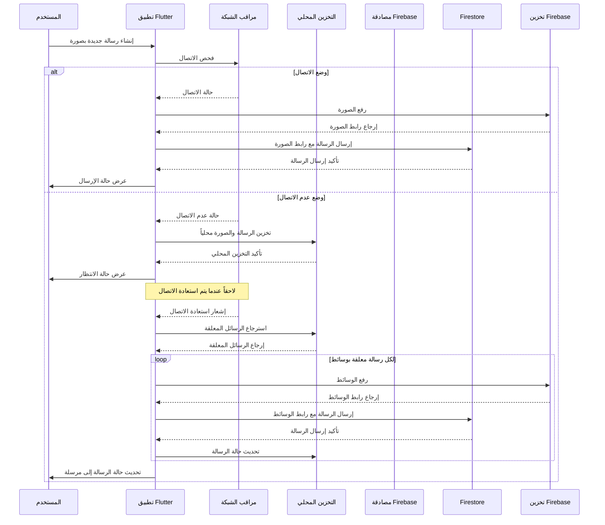
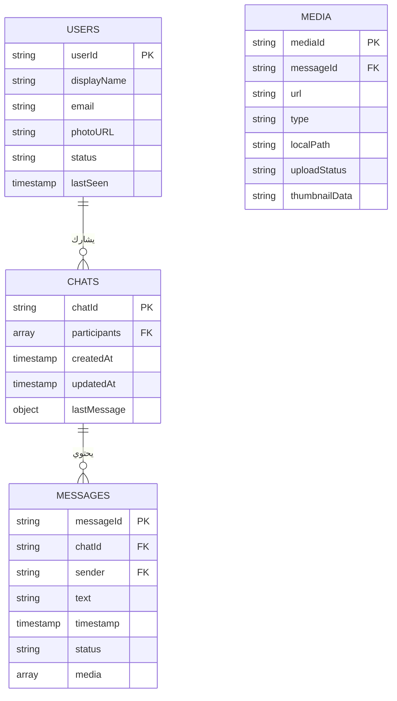
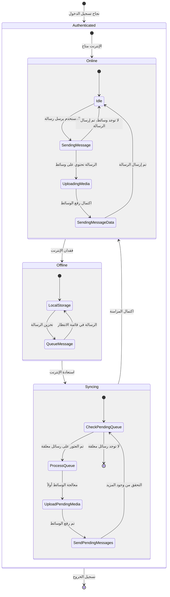
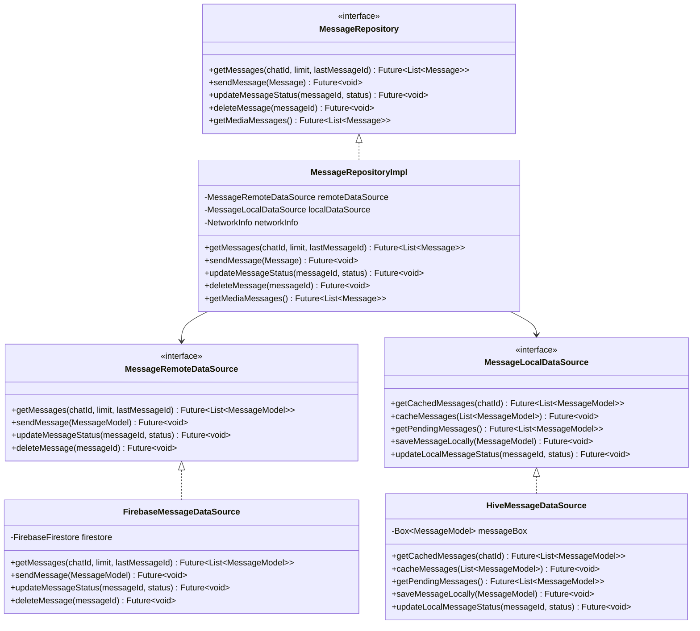
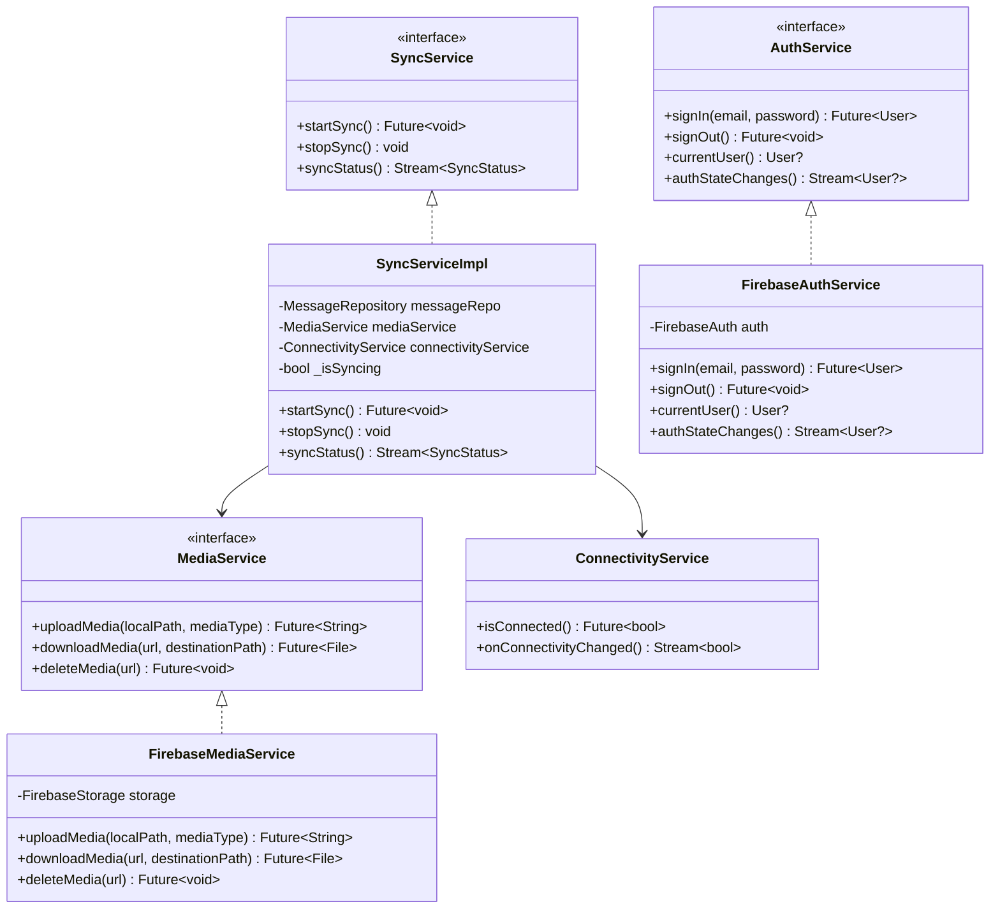
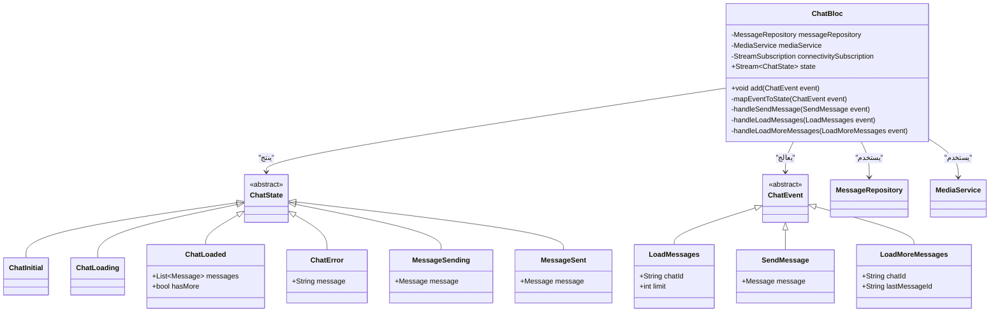
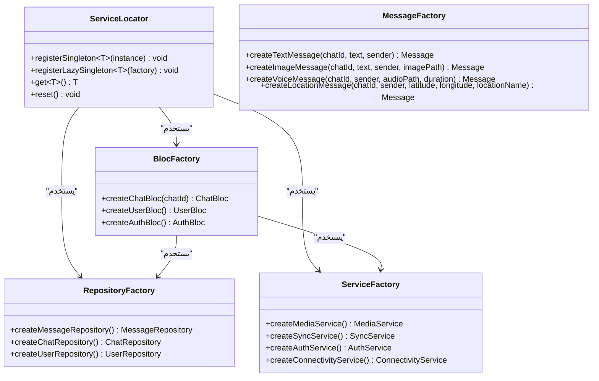

# تطبيق دردشة بأسلوب واتساب مع Firebase

## نظرة عامة على المشروع

تطبيق دردشة غني بالميزات مستوحى من واتساب، يدعم وضعي الاتصال وعدم الاتصال بالإنترنت مع تزامن سلس. يخزن التطبيق الرسائل والوسائط محلياً أثناء عدم الاتصال ويزامن البيانات تلقائياً عند استعادة الاتصال بالإنترنت.

## جدول المحتويات

1. [الميزات الأساسية](#الميزات-الأساسية)
2. [نظرة عامة على البنية](#نظرة-عامة-على-البنية)
   - [مخططات البنية](#مخططات-البنية)
   - [أنماط التصميم](#أنماط-التصميم)
   - [البنية التقنية](#البنية-التقنية)
   - [تدفق البيانات](#تدفق-البيانات)
3. [تصميم قاعدة البيانات](#تصميم-قاعدة-البيانات)
   - [مخطط Firebase](#مخطط-firebase)
   - [مخطط التخزين المحلي](#مخطط-التخزين-المحلي)
4. [خطة التنفيذ](#خطة-التنفيذ)
5. [إرشادات التطوير](#إرشادات-التطوير)
   - [المكتبات والتبعيات](#المكتبات-والتبعيات)
   - [اعتبارات الأداء](#اعتبارات-الأداء)
6. [التحسينات المستقبلية](#التحسينات-المستقبلية)

## الميزات الأساسية

- **وظائف الاتصال/عدم الاتصال**: يتم تخزين الرسائل والوسائط محلياً أثناء عدم الاتصال ومزامنتها عند العودة للاتصال
- **مشاركة الوسائط**: دعم مشاركة الصور والفيديو والصوت والمستندات والمواقع الجغرافية مع التحميل في الخلفية
- **تحميل سلس للرسائل**: ينفذ آلية تدفق لتحميل الرسائل على دفعات (100 رسالة مبدئياً مع تحميل المزيد عند التمرير للأعلى)
- **خلفية Firebase**: يستفيد من خدمات Firestore وStorage وAuthentication في Firebase
- **متعدد المنصات**: مبني بـ Flutter للتوافق مع iOS وAndroid
- **دعم الأجهزة المتعددة**: يمكن للمستخدمين الوصول إلى حساباتهم من أجهزة متعددة مع تزامن مناسب

## نظرة عامة على البنية

### مخططات البنية

#### مخطط المكونات



#### مخطط تسلسل - إرسال الرسائل (متصل/غير متصل)



#### مخطط قاعدة البيانات



#### مخطط الحالة



### أنماط التصميم

يستخدم التطبيق عدة أنماط تصميم لضمان قابلية التوسع والاختبار والصيانة.

#### نمط المستودع (Repository Pattern)

نمط المستودع يجرد مصادر البيانات ويوفر واجهة برمجة نظيفة لعمليات الوصول إلى البيانات.



**الفوائد**:

- فصل طبقة البيانات عن منطق الأعمال
- توفير واجهة برمجة نظيفة ومتسقة لعمليات البيانات
- جعل الكود أكثر قابلية للاختبار من خلال تمكين محاكاة مصادر البيانات
- تسهيل تنفيذ استراتيجيات الأولوية للوضع غير المتصل
- تمكين التبديل السلس بين مصادر البيانات (بعيدة/محلية)

#### نمط طبقة الخدمة (Service Layer Pattern)

نمط طبقة الخدمة يغلف منطق الأعمال المتعلق بالعمليات الخلفية، ومعالجة الملفات، والخدمات الأخرى.



**الفوائد**:

- عزل منطق الأعمال المعقد في خدمات مخصصة
- تمكين المعالجة في الخلفية والتعامل مع المهام طويلة الأمد
- توفير فصل نظيف للمسؤوليات
- جعل المكونات أكثر قابلية لإعادة الاستخدام عبر أجزاء مختلفة من التطبيق
- تبسيط اختبار منطق الأعمال بشكل منعزل

#### نمط إدارة الحالة (BLoC)

نمط BLoC (مكون منطق الأعمال) يفصل واجهة المستخدم عن منطق الأعمال، باستخدام التدفقات للتفاعلية.



**الفوائد**:

- فصل واضح بين واجهة المستخدم ومنطق الأعمال
- نهج تفاعلي مع إدارة حالة قائمة على التدفقات
- تحسين قابلية اختبار منطق الأعمال
- انتقالات حالة يمكن التنبؤ بها
- إعادة بناء فعالة لمكونات واجهة المستخدم المتأثرة فقط
- سهولة تصحيح الأخطاء وتتبع تغييرات الحالة

#### نمط المصنع (Factory Pattern)

أنماط المصنع تنشئ كائنات وخدمات معقدة مع حقن التبعيات بشكل صحيح.



**الفوائد**:

- مركزية منطق إنشاء الكائنات
- توفير طريقة متسقة لإنشاء كائنات معقدة
- تبسيط حقن التبعيات
- جعل الكود أكثر قابلية للاختبار من خلال السماح بسهولة استبدال التنفيذات
- تغليف تفاصيل التهيئة

### البنية التقنية

#### الواجهة الأمامية

- Flutter للتطوير عبر المنصات المتعددة للهواتف المحمولة
- نمط BLoC لإدارة الحالة
- Navigator 2.0/Go Router للتنقل في التطبيق

#### الواجهة الخلفية

- مصادقة Firebase لإدارة المستخدمين
- Firestore من Firebase لتخزين الرسائل
- تخزين Firebase للملفات الوسائطية
- وظائف Firebase السحابية للمعالجة في الخلفية

### تدفق البيانات

1. **عملية إرسال الرسائل**:
   - التحقق من اتصال الشبكة
   - إذا كان متصلاً: رفع ملفات الوسائط → إرسال الرسالة مع مراجع الملفات
   - إذا كان غير متصل: تخزين الرسالة والوسائط محلياً → وضعها في قائمة انتظار للمزامنة

2. **عملية المزامنة**:
   - مراقبة تغييرات اتصال الشبكة
   - عند إعادة الاتصال، استرجاع الرسائل المعلقة من التخزين المحلي
   - رفع ملفات الوسائط المعلقة أولاً
   - إرسال الرسائل المنتظرة مع مراجع الوسائط المحدثة
   - تحديث حالة الرسالة عبر جميع أجهزة المستخدم

3. **آلية تحميل الرسائل**:
   - جلب مبدئي لأحدث 100 رسالة
   - تحميل رسائل إضافية (50-100) عندما يتمرر المستخدم للأعلى
   - تنفيذ تخزين مؤقت فعال لتقليل قراءات قاعدة البيانات

4. **مزامنة الأجهزة المتعددة**:
   - كل جهاز يعرّف نفسه بمعرف جهاز فريد للتتبع
   - فقط الجهاز المنشئ يعالج رسائله المعلقة الخاصة من التخزين المحلي
   - تتم مزامنة تحديثات حالة الرسائل عبر جميع الأجهزة
   - قوائم انتظار الرسائل الخاصة بكل جهاز في التخزين المحلي تمنع التحميلات المكررة

## تصميم قاعدة البيانات

### مخطط Firebase

#### مجموعة المستخدمين

```text
users/{userId}
  - displayName: string
  - email: string
  - photoURL: string
  - status: string
  - lastSeen: timestamp
```

**مثال لوثيقة مستخدم**:

```json
// users/user123
{
  "displayName": "أحمد محمد",
  "email": "ahmed.mohammed@example.com",
  "photoURL": "https://firebasestorage.googleapis.com/users/avatars/user123.jpg",
  "status": "متاح",
  "lastSeen": "2023-10-20T15:45:32Z"
}
```

#### مجموعة المحادثات

```text
Chats/{chatId}
  - participants: [userId]
  - createdAt: timestamp
  - updatedAt: timestamp
  - lastMessage: {
      text: string,
      sender: userId,
      timestamp: timestamp,
      hasMedia: boolean,
      mediaType: string (اختياري)
    }
```

**مثال لوثيقة محادثة**:

```json
// Chats/chat101 - محادثة جماعية مع صورة في آخر رسالة
{
  "participants": ["user123", "user789", "user456"],
  "createdAt": "2023-10-10T14:30:00Z",
  "updatedAt": "2023-10-20T15:12:45Z",
  "lastMessage": {
    "text": "صور من فعالية الأمس",
    "sender": "user789",
    "timestamp": "2023-10-20T15:12:45Z",
    "hasMedia": true,
    "mediaType": "image"
  }
}
```

#### مجموعة الرسائل

```text
Chats/{chatId}/Messages/{messageId}
  - sender: userId
  - text: string
  - timestamp: timestamp
  - status: "sent" | "delivered" | "read" | "pending"
  - media: [
      {
        url: string,
        type: "image" | "video" | "audio" | "file" | "location",
        localPath: string (للتخزين غير المتصل),
        uploadStatus: "pending" | "uploading" | "uploaded" | "failed",
        thumbnailData: string (صورة مصغرة مشفرة بـ base64 للاستخدام غير المتصل),
        additionalData: object (اختياري - للبيانات الخاصة بالنوع)
      }
    ]
```

**مثال لوثيقة رسالة**:

```json
// Chats/chat101/Messages/msg234 - رسالة بصور متعددة
{
  "sender": "user789",
  "text": "صور من فعالية الأمس",
  "timestamp": "2023-10-20T15:12:45Z",
  "status": "sent",
  "media": [
    {
      "url": "https://firebasestorage.googleapis.com/messages/images/event1.jpg",
      "type": "image",
      "localPath": "/data/user/0/com.example.chatapp/files/media/event1.jpg",
      "thumbnailData": "data:image/jpeg;base64,/9j/4AAQSkZJRgABAQEAYABgAAD/2wBDAAEBAQ...",
      "uploadStatus": "uploaded",
      "additionalData": {
        "width": 1600,
        "height": 1200
      }
    },
    {
      "url": "https://firebasestorage.googleapis.com/messages/images/event2.jpg",
      "type": "image",
      "localPath": "/data/user/0/com.example.chatapp/files/media/event2.jpg",
      "thumbnailData": "data:image/jpeg;base64,/9j/4AAQSkZJRgABAQEAYABgAAD/2wBDAAEBAQ...",
      "uploadStatus": "uploaded",
      "additionalData": {
        "width": 1600,
        "height": 1200
      }
    }
  ]
}
```

### مخطط التخزين المحلي

#### بنية تخزين المحادثة

كل محادثة لها تخزين محلي مخصص للرسائل والوسائط ومعلومات الحالة.

```text
chats/{chatId}/
  - metadata (آخر وصول، عدد غير المقروءة، مسودة الرسالة)
  - messages/ (الرسائل المتصلة المخزنة مؤقتاً محلياً)
  - pendingMessages/ (الرسائل غير المتصلة بالإنترنت في انتظار الإرسال)
  - media/ (ملفات الوسائط المخزنة محلياً)
```

#### الرسائل المعلقة (حسب المحادثة)

```text
chats/{chatId}/pendingMessages/{messageId}
  - text: string
  - sender: userId
  - timestamp: timestamp
  - media: [
      {
        localPath: string,
        type: string,
        thumbnailData: string (صورة مصغرة مشفرة بـ base64),
        additionalData: object (اختياري)
      }
    ]
```

**مثال لرسالة معلقة**:

```json
// chats/chat789/pendingMessages/msg123
{
  "text": "تم إنشاء هذه الرسالة بدون اتصال",
  "sender": "user123",
  "timestamp": "2023-10-20T18:45:10Z",
  "media": [
    {
      "localPath": "/data/user/0/com.example.chatapp/files/media/chat789/offline_image.jpg",
      "type": "image",
      "thumbnailData": "data:image/jpeg;base64,/9j/4AAQSkZJRgABAQEAYABgAAD/2wBDAAEBAQ...",
      "additionalData": {
        "width": 1200,
        "height": 900,
        "caption": "تم التقاطها أثناء انقطاع الشبكة"
      }
    }
  ]
}
```

#### التخزين المؤقت المحلي للرسائل

يتم تخزين الرسائل المستلمة من Firebase مؤقتاً محلياً للوصول غير المتصل والتحميل السريع:

```text
chats/{chatId}/messages/{messageId}
  - نفس بنية رسائل Firebase مع بيانات وصفية إضافية للاستخدام المحلي
  - isRead: boolean (حالة القراءة المحلية)
  - localTimestamp: timestamp (متى تم استلام الرسالة محلياً)
```

#### تخزين الوسائط المحلية

يتم تخزين ملفات الوسائط في تنسيق منظم للوصول الفعال:

```text
media/{chatId}/{mediaType}/{filename}
```

## خطة التنفيذ

### المرحلة 1: الإعداد والمصادقة

- تهيئة المشروع باستخدام Flutter و Firebase
- تنفيذ عملية مصادقة المستخدم
- إنشاء مكونات واجهة المستخدم الأساسية

### المرحلة 2: وظائف الدردشة الأساسية

- تنفيذ المراسلة الأساسية (عبر الإنترنت فقط)
- تصميم وتنفيذ مخطط قاعدة البيانات
- إنشاء واجهة مستخدم للدردشة مع فقاعات الرسائل

### المرحلة 3: دعم وضع عدم الاتصال

- تنفيذ التخزين المحلي للرسائل باستخدام Hive/SQLite
- إنشاء بنية تخزين خاصة بالمحادثة
- إعداد آلية المزامنة
- إنشاء مراقبة حالة الشبكة
- تنفيذ تتبع الرسائل الخاص بالجهاز
- إنشاء قوائم انتظار رسائل خاصة بالجهاز في التخزين المحلي

### المرحلة 4: مشاركة الوسائط

- تنفيذ منتقي الوسائط
- إعداد تكامل تخزين Firebase
- تطوير نظام قائمة انتظار التحميل في الخلفية
- تنفيذ توليد الصور المصغرة للصور والفيديوهات وأنواع الوسائط الأخرى
- إنشاء تصور الموجة الصوتية للرسائل الصوتية
- إنشاء نظام تخزين مؤقت فعال للصور المصغرة

### المرحلة 5: تدفق الرسائل

- تنفيذ ترقيم الصفحات/التمرير اللانهائي
- تحسين أداء تحميل الرسائل
- إضافة إشعارات القراءة ومؤشرات الكتابة

### المرحلة 6: الاختبار والتحسين

- اختبار عبر المنصات
- تحسين الأداء
- تحسينات واجهة المستخدم/تجربة المستخدم

## إرشادات التطوير

### المكتبات والتبعيات

- **Flutter و Dart**: الإطار الأساسي
- **Firebase**: firebase_core, firebase_auth, cloud_firestore, firebase_storage
- **إدارة الحالة**: provider/flutter_bloc
- **الشبكات**: connectivity_plus, flutter_offline
- **التخزين المحلي**: hive/sqflite لقاعدة البيانات المحلية والتخزين غير المتصل
- **معالجة الوسائط**: image_picker, cached_network_image

### اعتبارات الأداء

- تنفيذ استراتيجيات تخزين مؤقت فعالة
- استخدام فهرسة Firebase بفعالية
- تحسين أحجام الصور قبل التحميل
- توليد وتخزين صور مصغرة صغيرة كسلاسل base64 للتحميل الفوري
- تنفيذ التحميل الكسول لمحتوى الوسائط
- استخدام استمرارية Firebase غير المتصلة
- تنظيم التخزين المحلي حسب المحادثة للوصول السريع إلى المحادثات الأخيرة

## التحسينات المستقبلية

- التشفير من طرف إلى طرف
- مكالمات صوتية/فيديو
- تحسينات مزامنة الأجهزة المتعددة
- ميزات محادثة جماعية محسنة
- تفاعلات الرسائل والردود
